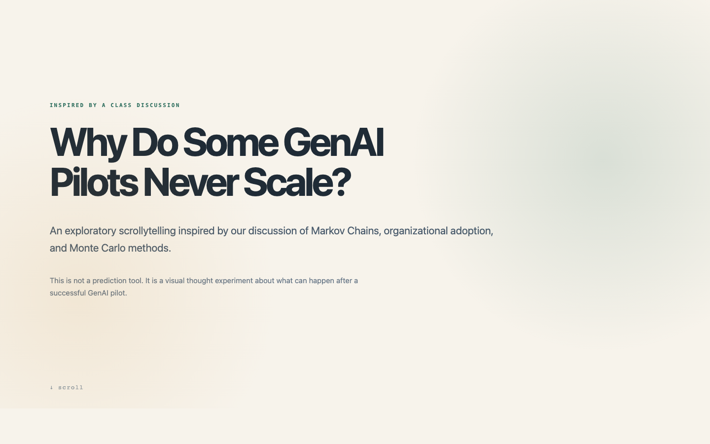

# Why Do Some GenAI Pilots Never Scale?

An exploratory scrollytelling inspired by a class discussion on Markov Chains, organizational adoption, and Monte Carlo methods.

## Core Story

A successful pilot is only one organizational state. Enterprise adoption requires assimilation and integration.

## Main Lens

- Markov Process
- Markov Chain
- Organizational adoption stages

## Supporting Models

- Threshold Theory
- Segregation Theory
- Diffusion
- Percolation
- Tipping Point

These supporting models explain why a GenAI pilot may:

1. Stall and be abandoned
2. Remain an isolated departmental capability
3. Move toward assimilation and integration

## Monte Carlo

Monte Carlo is included only as a light conceptual extension. The page does not use artificial percentages, a live simulation, or a fixed number of runs.

## Inspired By

- Max T. Brozynski and Benjamin D. Leibowicz — *Markov Models of Policy Support for Technology Transitions*
- Mumtaz Abdul Hameed and Nalin Asanka Gamagedara Arachchilage — *A Model for the Adoption Process of Information System Security Innovations in Organisations: A Theoretical Perspective*
- Nicholas Metropolis and Stanislaw Ulam — *The Monte Carlo Method*

## Live Site

https://aseumal.github.io/genai-pilots-exploratory-story/

## Description

Exploratory scrollytelling on why successful GenAI pilots may stall, remain isolated, or become integrated organizational capability.
